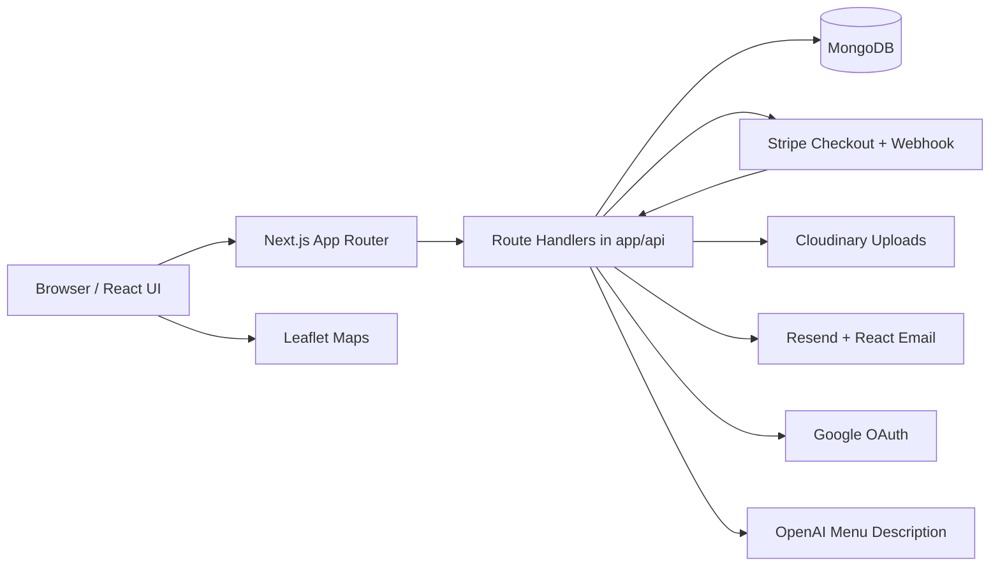
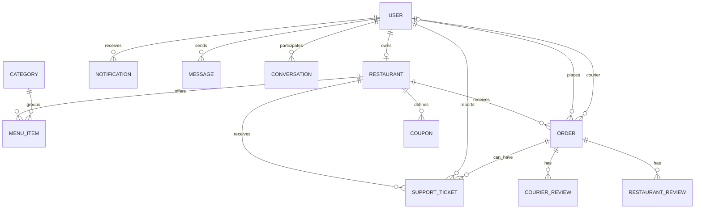
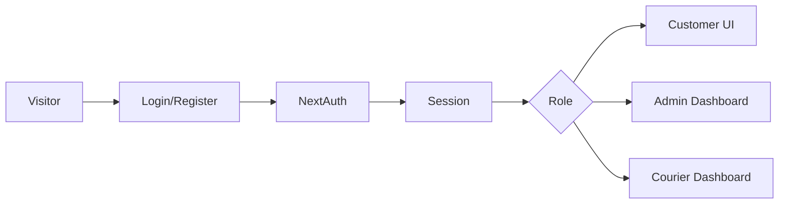
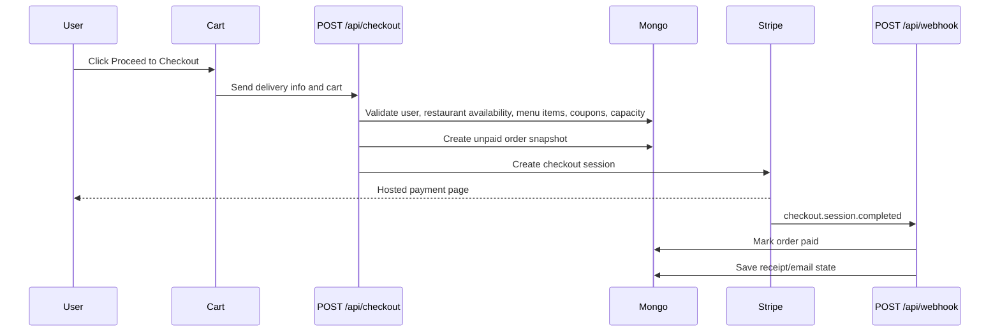
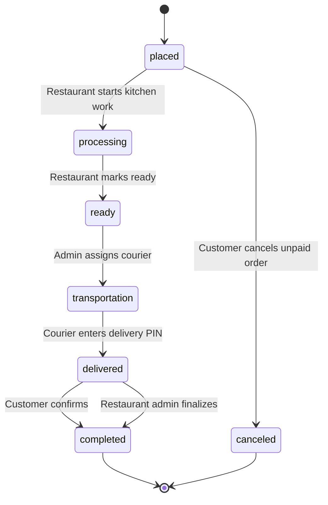
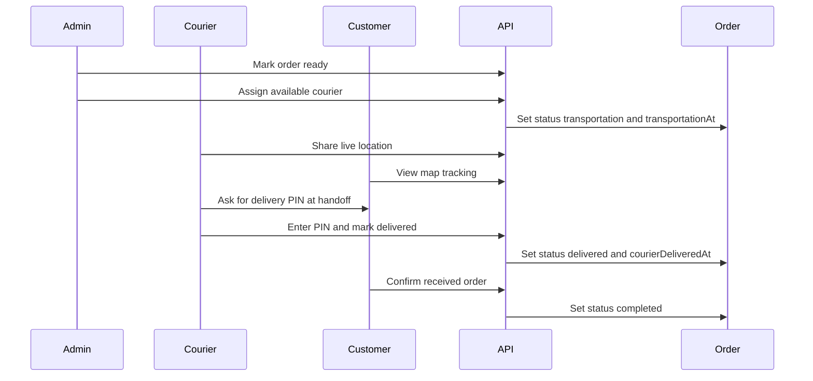
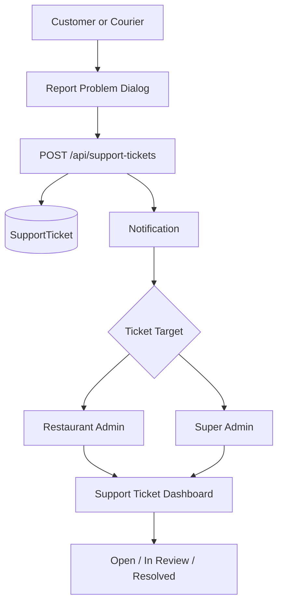

# Architecture

This document explains how the food ordering app is organized, how the main systems talk to each other, and how the important workflows move through the app.

## System Overview

The app is a full-stack Next.js App Router application. Pages, server route handlers, API logic, and UI live in the same repository. MongoDB stores the application data through Mongoose models. External services handle payments, media uploads, email, OAuth, AI text generation, and maps.



## Main Technology Layers

- `app/`: Next.js routes, pages, layouts, loading states, and API route handlers.
- `components/`: shared UI components and shadcn/Radix primitives.
- `contexts/`: client-side global state for cart, notifications, and messages.
- `hooks/`: client hooks such as profile and favorites data loading.
- `libs/`: auth, database, notifications, messages, coupons, loyalty, email, AI, and helper utilities.
- `models/`: Mongoose schemas and MongoDB collection contracts.
- `__tests__/`, `e2e/`, `mocks/`: Vitest unit/integration/e2e test areas.

## Application Areas

```mermaid
flowchart TD
  App[Next.js App]

  App --> Public[Public pages]
  App --> Customer[Customer flows]
  App --> Admin[Admin dashboard]
  App --> Courier[Courier flows]
  App --> Api[API routes]
  App --> Shared[Shared components]

  Public --> Menu["/menu and restaurant pages"]
  Public --> Auth["/login, /register, email verification"]

  Customer --> Cart["/cart"]
  Customer --> MyOrders["/my-orders"]
  Customer --> Favorites["/favorite-meals, /favorite-restaurants"]
  Customer --> Reviews["/reviews"]
  Customer --> Messages["/messages"]

  Admin --> Restaurant["/admin-dashboard/restaurant"]
  Admin --> MenuItems["/admin-dashboard/menu-items"]
  Admin --> Orders["/admin-dashboard/orders"]
  Admin --> Tickets["/admin-dashboard/support-tickets"]
  Admin --> Users["/admin-dashboard/users"]
  Admin --> Stats["/admin-dashboard/statistics"]

  Courier --> MyDelivery["/my-delivery"]
  Courier --> MyDeliveries["/my-deliveries"]
  Courier --> CourierDashboard["/courier-dashboard"]
```



## Data Model Map

The important persistent models are:

- `User`: account, role, profile fields, courier availability/location, restaurant ownership, favorites.
- `Restaurant`: owner, location, contact, images, working hours, blocked dates, tax, courier fee, preparation/delivery estimates, active order limit.
- `MenuItem`: restaurant item, category, image, prices, availability.
- `Order`: customer delivery details, cart snapshot, payment data, restaurant fee/tax snapshots, coupon/loyalty snapshots, estimate snapshots, route distance, status timeline timestamps, courier, delivery PIN, completion state.
- `Coupon`: restaurant-scoped discounts and validity rules.
- `RestaurantReview` and `CourierReview`: one review per completed order flow.
- `Notification`: role-aware notifications with read state and metadata routing.
- `Conversation` and `Message`: approved in-app messaging threads and messages.
- `SupportTicket`: reported order, delivery, restaurant, or app issues.
- `Category`: menu categories managed by super admin.



## Authentication And Roles

Authentication uses NextAuth. Credentials users can go through email verification and password reset flows. Google OAuth users are handled through the NextAuth Google provider.

Roles:

- `user`: customer account.
- `admin`: restaurant owner or super admin.
- `courier`: delivery account.

Super admin is identified by `NEXT_PUBLIC_SUPER_ADMIN_EMAIL` in the UI and optionally `SUPER_ADMIN_EMAIL` server-side.



## Checkout And Payment Flow

Checkout is intentionally server-authoritative. The cart can show warnings, but `/api/checkout` validates the final truth before creating a Stripe session.

Key checks:

- User must be signed in.
- Cart must not be empty.
- Cart items must belong to one restaurant.
- User cannot order from their own restaurant.
- User cannot start another checkout while a previous delivered order still needs customer confirmation.
- Menu items must still exist and be available.
- Restaurant must currently accept orders based on working hours, pause state, blocked dates, delivery radius, and active kitchen capacity.
- Restaurant active kitchen order count must be below `activeOrderLimit`.
- Coupon and loyalty discounts are validated server-side.
- Best coupon suggestions shown in cart are revalidated at checkout before Stripe is created.
- Reorders rebuild cart items from current `menu_items` records so deleted, unavailable, cross-restaurant, or changed-price items cannot silently proceed.



## Order Lifecycle

Orders move through a controlled status flow.



Timing fields on `Order` capture the real phase timestamps:

- `processingAt`
- `readyAt`
- `transportationAt`
- `courierDeliveredAt`
- `customerConfirmedDeliveryAt`
- `adminConfirmedDeliveryAt`
- `completedAt`
- `canceledAt`

Estimate snapshots are saved on each order:

- `estimatedPreparationMinutes`
- `estimatedDeliveryMinutes`
- `estimatedTotalMinutes`

This lets the order timeline compare expected timing against actual progress.

Operational monitoring builds on the same timestamps:

- `/api/orders/queue` returns active paid orders grouped by lifecycle phase.
- `/admin-dashboard/orders` surfaces late-order alerts and links admins to `/admin-dashboard/order-queue`.
- ETA-style notifications reuse estimate snapshots so status changes can include useful preparation or delivery timing.

## Delivery And Courier Flow



If the customer does not confirm, the restaurant owner can finalize delivery from the admin order detail page.

Courier delivery views also show route distance and estimated travel time. Completed delivery history can summarize completed deliveries, declined assignments, average delivery minutes, late deliveries, ratings, and total/average route distance.

## Support Ticket Flow

Customers and couriers can report a problem from the order or delivery UI. Admins manage tickets in `/admin-dashboard/support-tickets`.



Rules:

- Restaurant support tickets are visible to the restaurant owner for the related restaurant.
- App support tickets route to the super admin.
- Ticket updates are admin-only.

## Notifications And Messaging

Notifications are stored in MongoDB and polled through `NotificationsContext`. Notification routing is role-aware through `libs/notificationClient.ts`.

Important notification examples include order placement, payment, order status changes, ETA-style phase updates, courier assignment, support ticket creation, late active-order warnings, and delivery completion prompts.

Messages are app-native conversations, not open public chat. The allowed role combinations are enforced in `libs/messages.ts`.

Important messaging rules:

- Customer-to-customer chat is blocked.
- Customer conversations are tied to allowed order contacts.
- Couriers can message admins.
- Admins can message approved contacts.
- Conversations and messages are persisted in MongoDB.

## Media, Email, AI, And Maps

- Cloudinary stores uploaded user, restaurant, and menu item media.
- Resend and React Email send transactional auth and purchase receipt emails.
- OpenAI generates menu item descriptions through a server-only API route.
- Leaflet renders restaurant, customer, and courier map views.

## Testing Strategy

The project uses Vitest.

- Unit and route tests live in `__tests__/`.
- Database-backed e2e tests live in `e2e/`.
- Shared test fixtures and mocks live in `mocks/`.

Recommended commands:

```bash
npm run lint
npm run test
npm run test:api
npm run test:libs
npm run test:file -- __tests__/api/checkout.route.test.ts
npm run test:e2e
```

For risky areas, prefer focused route tests first:

- auth and role guards
- checkout and Stripe webhook behavior
- restaurant availability, best coupon suggestion, and reorder validation
- order lifecycle and delivery confirmation
- support ticket authorization
- courier assignment, location updates, route distance summaries, and delivery metrics
